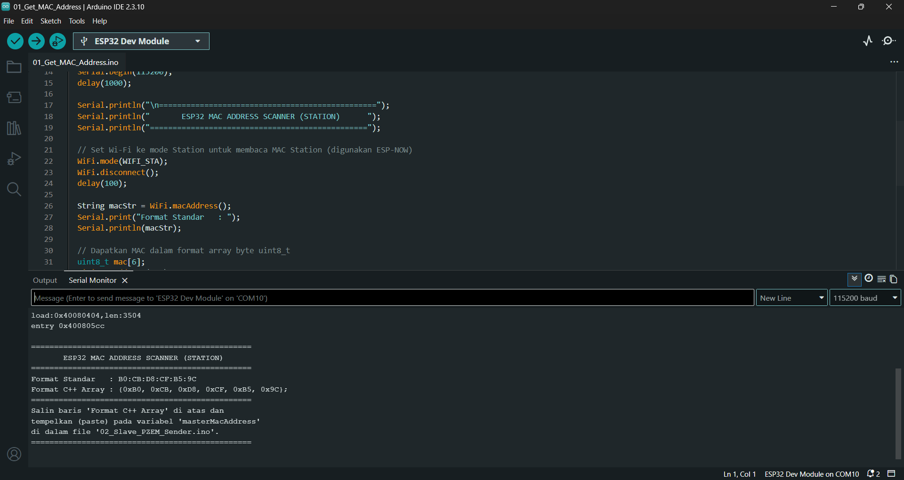
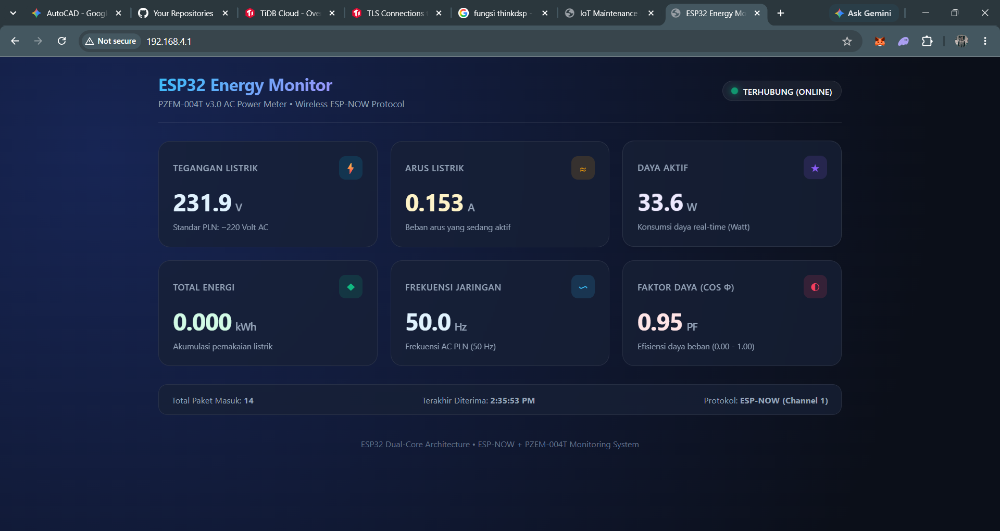
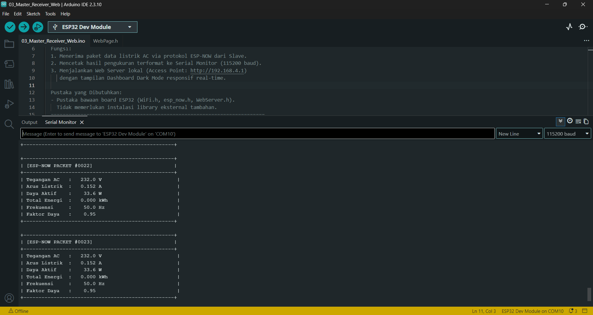

# Sistem Monitoring Energi Listrik AC: ESP-NOW + PZEM-004T

Proyek sistem pemantauan daya listrik AC nirkabel jarak jauh berbasis **2 unit ESP32** dan sensor presisi **PZEM-004T v3.0**. Data dikirimkan secara langsung antar-chip tanpa perantara router menggunakan protokol **ESP-NOW**, kemudian ditampilkan pada **Serial Monitor** dan antarmuka **Web Dashboard Lokal (Dark Mode)** interaktif.

---

## ⚡ Fitur Utama
- **Pengukuran Lengkap:** Tegangan (V), Arus (A), Daya Aktif (W), Akumulasi Energi (kWh), Frekuensi Jaringan (Hz), dan Faktor Daya (Power Factor / PF).
- **Ultra-Fast Wireless (ESP-NOW):** Transmisi data nirkabel peer-to-peer 2.4 GHz tanpa delay koneksi router.
- **Local Web Dashboard Modern:** Antarmuka responsif berbasis HTML5/CSS3 (Glassmorphism Dark Mode) dengan auto-refresh via AJAX tanpa reload halaman.
- **Dua Mode Wi-Fi Master:**
  - **Access Point (AP Mode - Default):** ESP32 Master memancarkan hotspot sendiri (`EnergyMonitor-Master`), dapat diakses langsung via HP/Laptop di `http://192.168.4.1` tanpa internet.
  - **Station (STA Mode - Opsi):** ESP32 Master dapat dihubungkan ke Wi-Fi rumah agar dapat diakses oleh semua perangkat dalam satu jaringan LAN.
- **Logging Serial Monitor Rapi:** Format tabel ASCII memudahkan debugging langsung melalui kabel USB.

---

## 🛠️ Kebutuhan Perangkat Keras (Hardware)
1. **2x ESP32 Development Board** (NodeMCU-32S, DOIT ESP32 DevKit v1, dsb.)
2. **1x Modul Sensor PZEM-004T v3.0** + Current Transformer (CT Coil)
3. **Kabel Jumper** (Female to Female)
4. **Kabel Listrik AC 220V** + Steker Colokan Listrik PLN
5. **Beban Listrik untuk Pengujian** (misal: Lampu pijar, pemanas air, kipas angin, setrika)

---

## ⚠️ PERINGATAN KESELAMATAN (HIGH VOLTAGE 220V AC)
> [!CAUTION]
> Terminal tegangan tinggi pada PZEM-004T terhubung langsung dengan tegangan listrik jala-jala PLN **220V AC**.
> - **JANGAN PERNAH** menyentuh pin terminal sekrup PZEM-004T saat kabel AC terhubung ke stopkontak!
> - Pasang penutup plastik pelindung PZEM sebelum menyalakan daya.
> - Pastikan koneksi kabel netral dan fasa terpasang kencang dan tidak ada serabut tembaga yang terbuka.

---

## 🔌 Skema Perkabelan (Wiring Diagram)

### 1. Sisi Tegangan Rendah (ESP32 Slave <-> PZEM-004T)
Modul PZEM-004T v3.0 membutuhkan suplai **5V** untuk memberi daya pada optocoupler internal:

| Pin PZEM-004T | Pin ESP32 (Slave) | Keterangan |
| :--- | :--- | :--- |
| **5V** | **VIN / 5V** | Suplai daya 5V untuk optocoupler |
| **GND** | **GND** | Ground bersama |
| **TX** | **GPIO 16 (RX2)** | Jalur Serial Receiver ESP32 |
| **RX** | **GPIO 17 (TX2)** | Jalur Serial Transmitter ESP32 |

---

### 2. Sisi Tegangan Tinggi (PZEM-004T <-> Listrik AC 220V & Beban)
```
          [LINE / FASA (220V)] ─────────┬─────────( Ke dalam lubang CT Coil )─────────> Ke Beban (L)
                                        │
                                        ▼ (Kabel cabang kecil)
                                  [Terminal L]
                                  [Terminal N]
                                        ▲ (Kabel cabang kecil)
                                        │
          [NETRAL (0V)]        ─────────┴──────────────────────────────────────────────> Ke Beban (N)
```
* Pasang terminal **L** dan **N** pada PZEM ke jalur Fasa dan Netral PLN (untuk mengukur tegangan dan memberi daya sensor).
* Pasang kedua kabel dari **CT Coil** ke 2 terminal kecil CT pada PZEM.
* **PENTING:** Masukkan **hanya 1 kawat kabel** (kabel Fasa saja, atau kabel Netral saja) menembus lubang CT. Jika kedua kabel dimasukkan bersamaan, medan magnet akan saling meniadakan sehingga pembacaan arus menjadi 0 A!

---

## 📦 Pustaka (Library) yang Diperlukan

Buka **Arduino IDE** $\rightarrow$ **Sketch** $\rightarrow$ **Include Library** $\rightarrow$ **Manage Libraries...**, lalu cari dan instal:
- **`PZEM004Tv30`** (oleh Jakub Mandula)

*(Pustaka `WiFi.h`, `esp_now.h`, dan `WebServer.h` sudah otomatis tersedia saat menginstal Board ESP32 di Arduino IDE).*

---

## 🚀 Panduan Langkah Demi Langkah (Step-by-Step)

### Langkah 1: Membaca MAC Address ESP32 Master
1. Buka file `01_Get_MAC_Address/01_Get_MAC_Address.ino`.
2. Hubungkan **ESP32 MASTER** ke laptop/PC dengan kabel USB.
3. Pilih board `ESP32 Dev Module` dan port COM yang sesuai, lalu klik **Upload**.
4. Buka **Serial Monitor** pada baud rate `115200`.
5. Anda akan melihat output seperti ini:
   ```text
   Format C++ Array : {0x24, 0x6F, 0x28, 0x7A, 0xB1, 0xC0};
   ```
6. **Salin (copy)** baris array tersebut.

---

### Langkah 2: Konfigurasi & Upload ESP32 Slave (Sensor)
1. Buka file `02_Slave_PZEM_Sender/02_Slave_PZEM_Sender.ino`.
2. Cari baris berikut (sekitar baris 37):
   ```cpp
   uint8_t masterMacAddress[] = {0xFF, 0xFF, 0xFF, 0xFF, 0xFF, 0xFF};
   ```
3. Ganti dengan MAC Address Master yang telah Anda salin di Langkah 1:
   ```cpp
   uint8_t masterMacAddress[] = {0x24, 0x6F, 0x28, 0x7A, 0xB1, 0xC0};
   ```
4. Hubungkan **ESP32 SLAVE** ke PC dan klik **Upload**.
5. Setelah selesai, pasang kabel jumper ke sensor PZEM-004T sesuai diagram pinout di atas.

---

### Langkah 3: Upload Firmware ESP32 Master (Web Server)
1. Buka file `03_Master_Receiver_Web/03_Master_Receiver_Web.ino`.
2. Hubungkan kembali **ESP32 MASTER** ke PC dan klik **Upload**.
3. Buka **Serial Monitor** (`115200 baud`).

---

### Langkah 4: Mengakses Web Dashboard Lokal
1. Hubungkan Wi-Fi di HP atau Laptop Anda ke hotspot yang dipancarkan Master:
   - **Nama Wi-Fi (SSID):** `EnergyMonitor-Master`
   - **Password:** `12345678`
2. Buka web browser (Google Chrome / Safari / Edge) dan ketik alamat:
   ```
   http://192.168.4.1
   ```
3. Dashboard Dark Mode akan langsung menampilkan nilai parameter listrik secara real-time setiap detik!

---

## 🔍 Mengapa Saluran (Channel) Wi-Fi Harus Sama?
Protokol ESP-NOW bekerja pada frekuensi radio fisik Layer 2. Agar Slave dan Master dapat saling mendengar sinyal satu sama lain:
- ESP32 Master mengunci frekuensi pada **Wi-Fi Channel 1** saat menyalakan Access Point.
- ESP32 Slave mengunci saluran radio ke **Wi-Fi Channel 1** menggunakan fungsi:
  ```cpp
  esp_wifi_set_channel(WIFI_CHANNEL, WIFI_SECOND_CHAN_NONE);
  ```
Jika saluran tidak sama, komunikasi ESP-NOW tidak akan pernah terhubung.

---

## ❓ Solusi Masalah Umum (Troubleshooting)

| Gejala Masalah | Penyebab | Solusi |
| :--- | :--- | :--- |
| **Nilai tegangan & daya NaN / 0 di Slave** | Tegangan AC 220V belum masuk atau kabel RX/TX terbalik | Periksa apakah colokan AC 220V sudah terpasang. Tukar posisi kabel pin GPIO 16 (RX2) dan GPIO 17 (TX2). |
| **Status kirim ESP-NOW: GAGAL** | MAC Address Master salah atau Master belum menyala | Pastikan ESP32 Master sudah menyala dan MAC Address di file Slave sudah sesuai persis dengan output `01_Get_MAC_Address`. |
| **Tegangan normal tapi Arus selalu 0.000 A** | CT Coil belum terpasang atau menjepit kedua kabel AC | Pastikan lubang CT hanya dilewati oleh **1 kawat kabel Fasa saja** dan beban listrik dalam kondisi menyala. |
| **Halaman web tidak mau terbuka di HP** | HP beralih otomatis ke data seluler karena Wi-Fi tanpa internet | Matikan data seluler (Mobile Data) di HP sementara waktu agar HP tetap mengakses jaringan lokal `192.168.4.1`. |

---

## 📸 Hasil Pengujian & Dokumentasi Eksperimen

Pengujian fungsionalitas sistem telah berhasil dilakukan menggunakan beban **Motor Listrik 1 Fasa** yang dihubungkan ke sumber tegangan jala-jala AC 220V PLN. Berikut adalah dokumentasi tahapan dan hasil pembacaan parameter listrik secara real-time:

### 1. Pembacaan MAC Address Master
ESP32 Master menjalankan skrip scanner untuk mendapatkan alamat fisik MAC Address radio Wi-Fi Station:


*Gambar 1: Output Serial Monitor Arduino IDE menampilkan MAC Address fisik ESP32 Master (`B0:CB:D8:CF:B5:9C`) dalam format array C++.*

---

### 2. Monitoring via Web Dashboard Lokal (Beban Motor Listrik 1 Fasa)
Tampilan visual dashboard Dark Mode responsif saat diakses melalui browser (`http://192.168.4.1`) ketika motor listrik 1 fasa sedang menyala dan berputar:


*Gambar 2: Antarmuka Web Dashboard real-time menampilkan parameter motor listrik 1 fasa: Tegangan 231.9 V, Arus 0.153 A, Daya 33.6 W, Frekuensi 50.0 Hz, dan Faktor Daya 0.95.*

---

### 3. Monitoring via Serial Monitor ESP32 Master
Log data paket ESP-NOW yang diterima oleh Master secara periodik pada baud rate `115200`:


*Gambar 3: Penerimaan paket ESP-NOW (#0022 dan #0023) pada Serial Monitor Master dengan format tabel ASCII yang rapi dan konsisten.*

